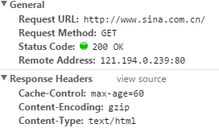

在web应用中，服务器把网页传给浏览器，实际上就是把网页的HTML代码发送给浏览器，让浏览器显示出来。而浏览器和服务器之间的传输协议是HTTP，所以：
- HTML是一种用来定义网页的文本，会HTML，就可以写网页
- HTTP是在网络上传输HTML的协议，用于浏览器和服务器之间的通信。


```
GET/HTTP/1.1
```
GET表示一个读取请求，将从服务器获取网页数据，/表示URL的路径，URL总是以/开头，/就表示首页，最后的HTTP/1.1表示采用HTTP协议版本是1.1。目前HTTP协议的版本就是1.1。但是大多数服务器也支持1.0版本，主要区别在于1.1版本允许多个HTTP请求复用一个TCP连接，以加快传输速度。

从第二行开始，每一行都类似于Xxx:abcdefg:
```
www.sina.com.cn
```
表示请求的域名是www.sina.com.cn。如果一台服务器有多个网站，服务器就需要通过Host来区分浏览器请求的是哪个网站。

继续往下找到Response Headers,电机view source,显示服务器返回的原始相应数据：



HTTP相应分为Header和Body两部分(Body是可选项)，
```
200 OK
```
200表示一个成功的响应，后面的OK是说明。失败的相应有404 Not Found:网页不存在，500 Internal Server Error:服务器内部出错，等等。
```
Content-Type: text/thml
```
Content-Type指示响应的内容，这里是text/html表示HTML网页。请注意，浏览器是依靠Content-Type来判断响应的内容是网页还是图片，是视频还是音乐。浏览器并不是靠URL来判断响应的内容，所以，即使URL是http://example.com/abc.jpg, 它也不一定是图片。
当浏览器读取到新浪首页的HTML源码后，它会解析HTML，显示页面然后，根据HTML里面的各种链接，在发送HTTP请求给新浪服务器，会拿到响应的图片，视频、flash、JavaScript脚本、CSS等各种资源，最终跳出一个完整的页面。

### HTTP请求
跟踪了新浪的首页，我们来总结一下HTTP的流程：
步骤1：浏览器首先向服务器发送HTTP请求，请求包括：
- 方法：GET还是POST，GET还是POST，GET仅请求资源，POST会附带用户数据；
- 路径：/full/url/path
- 域名：由Host指定：Host:www.sina.com.cn
如果是post，那么请求还会包括一个Body,包含用户数据。
步骤2：服务器向浏览器返回HTTP响应，响应包括：
响应代码：200表示成功，3xx表示重定向，4xx表示客户发送的请求有误，5xx表示服务器处理时发生了错误；

响应类型：由Content-Type指定；

以及其他相关的Header;

通常服务器的HTTP响应会携带内容，也就是有一个Body,包含响应的内容，网页的HTML源码就在Body中。

步骤3：如果浏览器还需要继续向服务器请求其他资源，比如图片，就再次发出HTTP请求，重复步骤1、3。

web采用的HTTP协议采用了非常简单的请求响应模式，从而大大简化了开发。我们写一个页面时，我们只需要在HTTP请求中吧HTNL发送出去，不考虑如何附带图片、视频等，浏览器1如果请求图片和视频，它会发送另一个HTTP请求，因此，一个HTTP请求值处理一个资源。

HTTP协议同时具有极强的扩展性，虽然浏览器的请求是http://www.sina.com.cn/ 的首页，但是新浪在HTML中可以炼乳其他的服务器资源，比如从而将请求压力分散到各个服务器上，并且，一个站点可以链接到其他站点，无数个站点互相链接起来，就形成了World Wide Web，简称WWW。
### HTTP格式
每个HTTP请求和响应都遵循相同的格式，一个HTTP包含Header和Body两部分，其中Body是可选的。

HTTP协议是一种文本协议，所以，它的格式也非常简单。HTTP GET请求的格式：
```
GET /path HTTP/1.1
Header1: Value1
Header2: Value2
Header3: Value3
```
每个Header一行一个，换行符是\r\n。

HTTP POST请求的格式：
```
POST /path HTTP/1.1
Header1: Value1
Header2: Value2
Header3：Value3

body data goes here
```
当连续遇到两个\r\n时，Header部分结束，后面的数据全部是BOdy。

HTTP响应的格式：
```
200 OK
Header1: Value1
Header2: Value2
Header3：Value3

body data goes here
```
HTTP响应如果包含body,也是通过\r\n\r\n来分隔的。请再次注意，Body的数据类型由Content-Type头来确定，如果是网页，Body就是文本，如果是图片，Body就是图片的二进制数据。

当存在Centent-Encoding时，Body数据是被压缩的，最常见的压缩方式是gzip，所以，看到Content-Encoding:gzip时，需要将Body数据先解压缩，才能得到真正的数据。压缩的目的在于减少Body的大小，加快网络传输。
