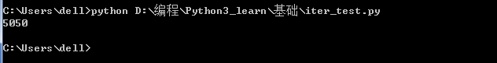

### 循环
Python提供一个range()函数，可以生成一个整数序列，再通过list()函数就可以转换为list，比如range(5)，生成的序列是从0开始小于5的整数：
```Python
>>> list(range(5))
[0, 1, 2, 3, 4]
```
range(101)就可以生成0-100的整数序列，计算如下：
```Python
sum = 0
for x in range(101):
	sum = sum + x

print(sum)
```

