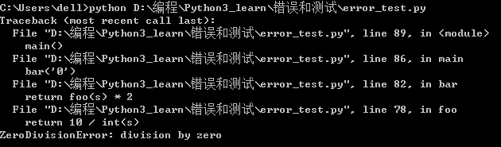
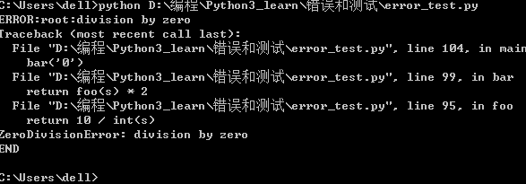
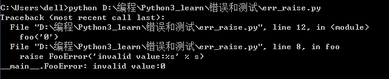
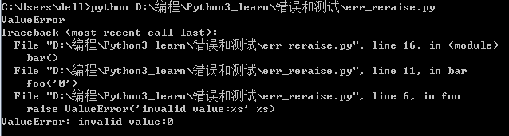

print()函数可以接受多个字符串，用逗号','隔开，就可以连成一串输出：
```Python
>>> print('quick','jumps','lazy')
quick jumps lazy
```
print()会依次打印每个字符串，遇到逗号','就会输出一个空格。
```Python
try:
    print('try...')
    r = 10 / 0
    print('result:', r)
except ZeroDivisionError as e:
    print('except:', e)
finally:
    print('finally...')
print('END')
```
结果：
```
try...
except: division by zero
finally...
END
```
当我们认为某些代码可能会出错时，就可以用try来运行这段代码，如果执行出错，则后续代码不会继续执行，而是直接跳转至错误处理代码，即except语句块，执行完except语句块后，如果有finally语句块，则执行finally语句块，至此，执行完毕。

从输出可以看到，当错误发生时，后续语句print('result',r)不会被执行except由于捕捉到ZeroDivisionError,因此被执行。最后，finally语句被执行。然后程序继续按照流程往下走。
把除数从0改为2，则执行结果如下：
```
try...
result: 5.0
finally...
END
```
你还可以猜测，错误应该有很多种类，如果发生了不同类型的错误，应该由不同的except语句块处理。没错，可以有多个except语句块来捕获不同类型的错误：
```Python
try:
    print('try...')
    r = 10 / int('a')
    print('result:', r)
except ValueError as e:
    print('ValueError', e)
except ZeroDivisionError as e:
    print('except:', e)
finally:
    print('finally...')
print('END')
```
结果：
```
try...
ValueError invalid literal for int() with base 10: 'a'
finally...
END
```
int()函数可能会抛出ValueError,所以我们用一个except捕获ValueError,用力一个捕获ZeroDivisionError。
此外，如果没有错误发生，可以在except语句块后面加一个else，没有错误发生时，就会自动执行else语句：
```Python
try:
    print('try...')
    r = 10 / int('2')
    print('result:', r)
except ValueError as e:
    print('ValueError', e)
except ZeroDivisionError as e:
    print('except:', e)
else:
    print('no error!')
finally:
    print('finally...')
print('END')
```
Python的错误也是class,所有的错误类型都继承自BaseException,所以在使用except时需要注意的是，它不但捕获该类型的错误，还把其子类也一网打尽。

使用try...except捕获错误还有一个巨大的好处，就是可以跨多层调用，比如函数main()调用bar(),bar()调用foo()，结果foo()出错了，这时候只要main()捕获到了，就可以处理：
```Python
def foo(s):
    return 10 / int(s)
def bar(s):
    return foo(s) * 2
def main():
    try:
        bar('0')
    except Exception as e:
        print('Error', e)
    finally:
        print('finally...')
```
也就是说，不需要在每个可能出现错误的地方都去捕捉错误，只要在合适的层次去捕捉错误就可以了。
### 调用堆栈
如果错误没有被捕获，它就会一直上抛，最后被Python解释器捕获打印出一个错误信息，然后程序退出：
```Python
def foo(s):
    return 10 / int(s)


def bar(s):
    return foo(s) * 2


def main():
    bar('0')


main()
```
结果如下:


### 记录错误
如果不捕获错误，自然可以让Python解释器打印出错误，但是程序也被结束了。既然我们可以捕获错误，就可以把错误堆栈打印出来，然后分析错误原因，同时让程序继续执行下去。

Python内置的logging模块可以非常容易地记录错误信息：
```Python
import logging


def foo(s):
    return 10 / int(s)


def bar(s):
    return foo(s) * 2


def main():
    try:
        bar('0')
    except Exception as e:
        logging.exception(e)


main()
print('END')
```
同样是出错，但程序打印完错误信息后会继续执行，并正常退出。
结果：

通过配置，logging还可以把错误记录到日志文件里，方便事后查询。

### 抛出错误
因为错误是class,捕获到一个错误就是捕获到该class的一个实例。因此,错误并不是凭空产生的，而是有意创建并抛出的。Python的内置函数会抛出很多类型的错误，我们自己编写的函数也可以抛出错误。

如果要抛出错误首先根据需要，可以定义一个错误的class，选择好继承关系，然后用raise抛出一个错误的实例：
```Python
class FooError(ValueError):
    pass


def foo(s):
    n = int(s)
    if n == 0:
        raise FooError('invalid value:%s' % s)
    return 10 / n


foo('0')
```
最后，我们可以跟踪到自己定义的错误：


只有在必要的时候我们才定义自己的错误类型。一般我们都可以选用Python已有的内置的错误类型。
我们来看另一种错误处理的方式:
```Python
# err_reraise.py

def foo(s):
    n = int(s)
    if n==0:
        raise ValueError('invalid value:%s' %s)
    return 10/n

def bar():
    try:
        foo('0')
    except ValueError as e:
        print('ValueError')
        raise

bar()
```
结果：

在bar()函数中，我们明明已经捕获了错误，但是，打印一个ValueError!后，又把错误通过raise语句抛出去了，这不是有病么?

这种方式十分操场见。捕获错误的目的只是记录一下，便于后续追踪。由于当前函数不知道应该怎么处理该错误，所以，最恰当的方式是继续往上抛，让顶层调用者去处理。

raise语句如果不带参数，就会把当前错误原样抛出。此外，在except中raise一个Error还可以把一种类型错误转化为另一种类型。
```Python
try:
    10/0
except ZeroDivisionError :
    raise ValueError('input error!')
```
结果：
```
ValueError: input error!
```
